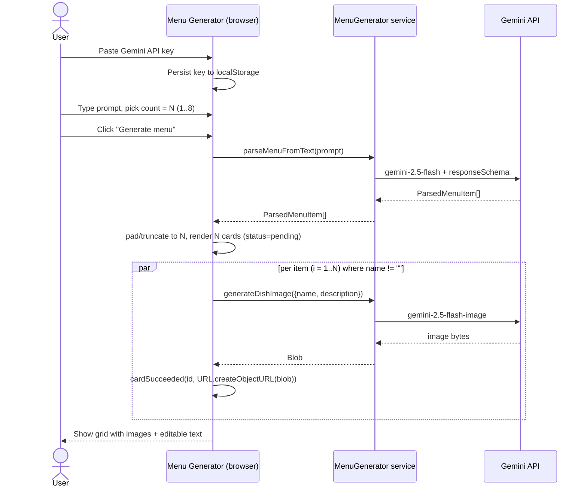

# Flow A — Text prompt only

Sequence of API calls and state transitions when the user clicks Generate menu
with a text prompt and no reference photo.

## Diagram

## Participants

- **User** — types prompt, picks count, clicks Generate menu, edits card fields.
- **App** — React app rendered in the browser; holds reducer state.
- **Svc** — MenuGenerator service injected via context; either real or fake.
- **Gemini API** — Google's hosted models, called via @google/genai.

## What this diagram does NOT cover

- Authentication errors and rate-limit handling (see ErrorBanner + cardFailed states).
- Per-card regenerate (see sequence-regenerate-card.md).
- Cases where parseMenuFromText returns fewer than N items (blank-padding fills remaining slots with empty cards that stay in pending status until user input).
- Flow B: upload photo as menu source (see sequence-flow-b-upload.md).
- The ?fake=true demo mode that bypasses the API key requirement and uses fakeMenuGenerator.
