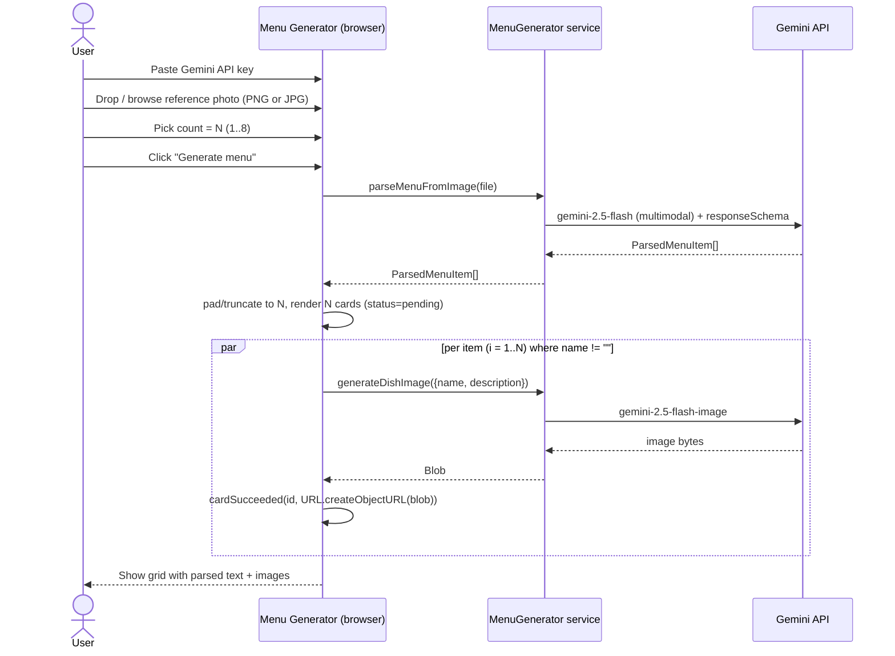

# Flow B — Upload menu photo

Sequence of API calls and state transitions when the user clicks Generate menu
with a reference photo (PNG or JPEG of an existing menu) and no text prompt.

## Diagram

## Participants

- **User** — drops or browses a menu photo, picks count, clicks Generate menu, edits card fields.
- **App** — React app rendered in the browser; holds reducer state.
- **Svc** — MenuGenerator service injected via context; either real or fake.
- **Gemini API** — Google's hosted models, called via @google/genai. The multimodal call uses gemini-2.5-flash with the photo inlined as base64.

## What this diagram does NOT cover

- Text-only flow with no reference photo (see sequence-flow-a-text.md).
- Authentication errors and rate-limit handling (see ErrorBanner + cardFailed states).
- Per-card regenerate after parsing (see sequence-regenerate-card.md).
- Cases where parseMenuFromImage returns fewer than N items (blank-padding applies, same as Flow A).
- Multi-image upload (out of scope for v1 — only one reference photo is supported).
- Style-reference uploads (the upload zone is OCR-source only in v1).
- The ?fake=true demo mode that bypasses the API key requirement and uses fakeMenuGenerator.
