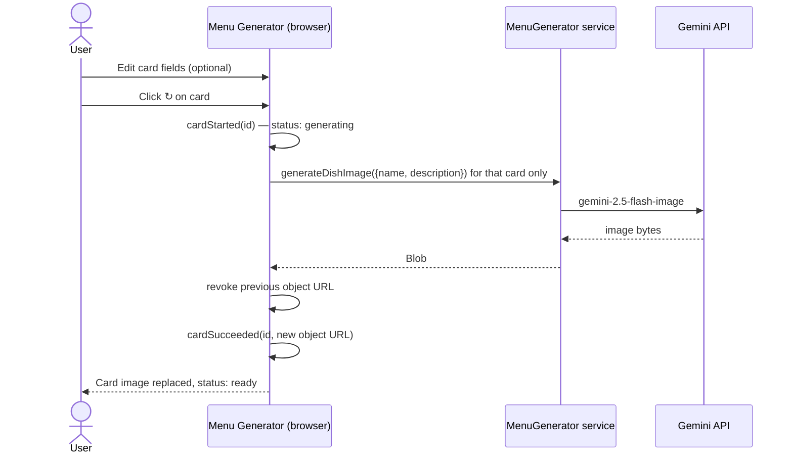

# Per-card regenerate

Sequence of calls and state transitions when the user clicks the ↻ button on
a single menu card to regenerate its image, optionally after editing the card's
text fields.

## Diagram

## Participants

- **User** — optionally edits the card's text fields (name, description, category, price), then clicks ↻ to regenerate just this card's image.
- **App** — React app rendered in the browser; dispatches cardStarted / cardSucceeded / cardFailed actions to the reducer.
- **Svc** — MenuGenerator service injected via context; only generateDishImage is called in this flow.
- **Gemini API** — Google's hosted models; only the image model (gemini-2.5-flash-image) is called.

## What this diagram does NOT cover

- The initial generation flows that produce the card grid (see sequence-flow-a-text.md and sequence-flow-b-upload.md).
- Sibling cards: only the targeted card's status changes during regenerate. All other cards remain in their current status.
- Failure path: if generateDishImage throws, the card transitions to status = error with an error badge rather than the success path shown here.
- Cancellation: if the user navigates away or the component unmounts, the in-flight request is cancelled via AbortSignal. The card status is not updated in that case.
- Blank cards (status = pending with empty name and description): the ↻ button is disabled on blank cards. The user must type at least one of name or description before regenerating.
