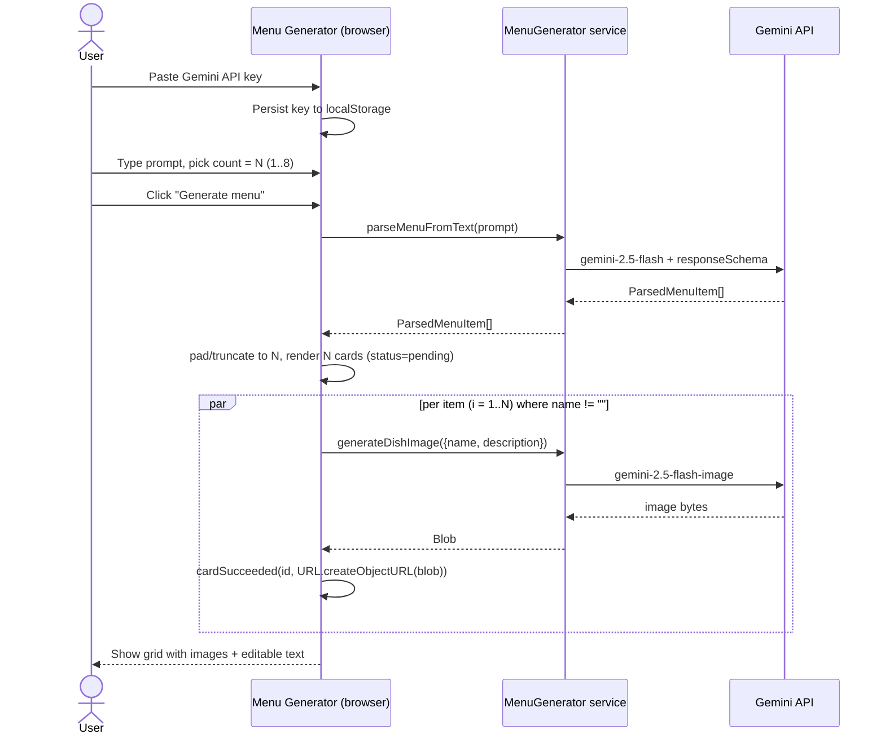
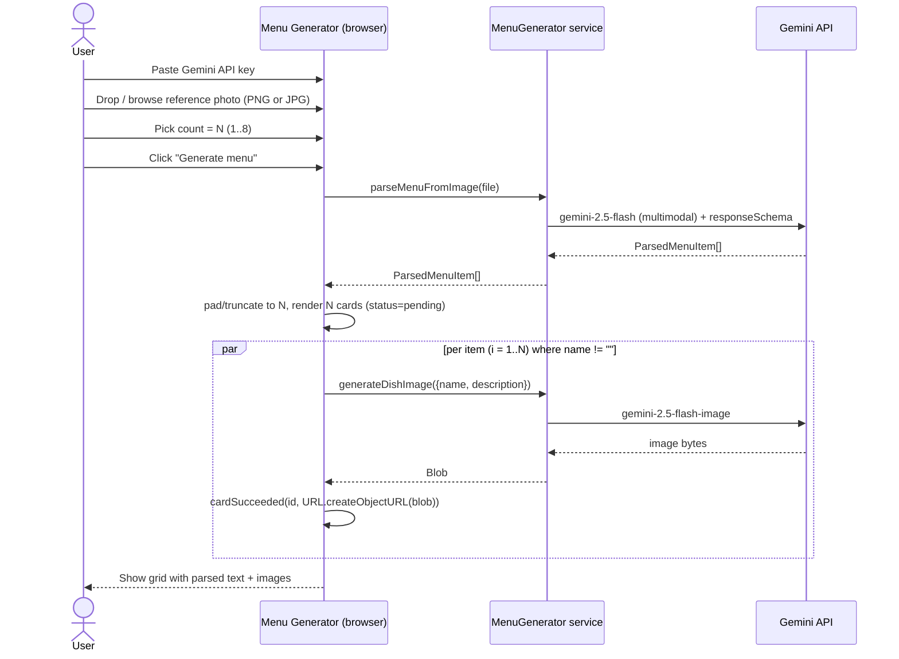
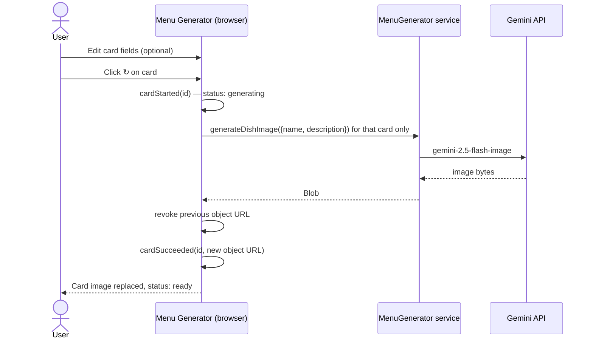

# Menu Generator — Design

- **Status:** Draft, pending user review
- **Date:** 2026-05-09
- **Author:** Brainstormed with the user via the `superpowers:brainstorming` skill
- **Source prompt:** `prompts/initial-prompt.md`
- **Mockup:** `designs/photo-realistic-menu-generator.png`
- **Standalone HTML reference:** `designs/photo-realistic-menu-generator_standalone_.html`

## 1. Scope and user flows

### 1.1 One-sentence summary

A static React + Vite single-page app where a user pastes their own Gemini API key, then either (a) describes a menu in text and gets N AI-generated dish photos with editable card text, or (b) uploads a photo of an existing menu, has it parsed into items, and gets one AI-generated photo per parsed item.

Both flows share the same shape: **parse → generate one image per item**. The only difference is what gets parsed.

### 1.2 Flow A — Text prompt only

1. User pastes a Gemini API key (required, persisted to `localStorage`).
2. User types a prompt (e.g. "A four-course Italian dinner — antipasto $5, pasta $10, main $25, and a dolce $14") and picks an item count via a stepper (1–8, default 4).
3. User clicks **Generate menu**. The app calls `gemini-2.5-flash` (text model) once with the prompt and a JSON `responseSchema`, asking for an array of `{ category, name, description, price }`. The app takes the first N items. If the parser returns fewer than N, the remaining slots are filled with blank `ParsedMenuItem`s (`{ category: '', name: '', description: '', price: '' }`); blank slots still render an editable `<MenuCard>` but skip image generation (status `pending` until the user types into the card and triggers per-card regenerate).
4. For each parsed item, the app calls `gemini-2.5-flash-image` once to generate a photo from the parsed `name + description`.
5. A grid of N cards appears. Each card shows the generated image plus the parsed `category`, `name`, `description`, and `price` — all inline-editable.
6. User can inline-edit any text field, or click ↻ on a card to regenerate just that card's image (using the card's current edited text).

### 1.3 Flow B — Upload menu photo

1. Same key + count step. User drops a photo of an existing menu into the upload zone (or uses the `browse` link). The textarea is ignored when a reference photo is present.
2. User clicks **Generate menu**. The app calls `gemini-2.5-flash` (multimodal) once with the image and the same JSON `responseSchema` as Flow A. Same first-N / blank-padding rule.
3. Same per-item image generation as Flow A.
4. Cards render with parsed text pre-filled and the generated image. Inline edit and per-card regenerate work the same as Flow A.

### 1.4 Out of scope (v1)

- Adding, removing, or reordering cards.
- Exporting, sharing, or downloading the menu.
- Multi-image upload.
- Style-reference uploads (the upload zone is OCR-source only).
- Real authentication or sign-on.
- A server proxy for the Gemini API.
- Persistence beyond the API key and last-used count.

## 2. Architecture overview

The architecture is the recommended Option B from the brainstorming session: a thin `MenuGenerator` service interface with two implementations (real `gemini` and `fake` for tests/demos), injected via React Context.

Component tree:

```
<App>
└── <ApiKeyGate>                       // when no key (and not ?fake=true): renders <ApiKeyForm> centered, nothing else
    └── <MenuGeneratorProvider>        // injects real or fake service; only mounts when ApiKeyGate passes
        ├── <Header>                   // brand mark + "Menu Generator" + "CREATE YOUR GRAPHICAL MENU"
        └── <main>
            ├── <PromptForm>
            │   ├── <ReferencePhotoDropzone>
            │   ├── <CountStepper>
            │   ├── <SuggestionChips>
            │   └── <ChangeApiKeyLink>
            ├── <ErrorBanner>
            └── <MenuGrid>
                └── <MenuCard>
```

`<ApiKeyForm>` is `<ApiKeyGate>`'s fallback view when `apiKey` is not set; it is not a sibling of `<MenuGeneratorProvider>`. In `?fake=true` mode the gate is a no-op pass-through so the demo can boot without a key.

Cross-cutting:

- `<MenuGeneratorProvider>` injects the active `MenuGenerator` service into context. A `?fake=true` URL flag swaps in `fakeMenuGenerator` for demos and manual testing without a key.
- No router. Single page.
- No global UI library. Plain CSS Modules per component, sharing tokens (palette, spacing, typography) from `src/styles/tokens.css` to match the warm cream / orange / charcoal palette in the mockup.
- A `<Header />` component is extracted for tidiness and to make the brand mark, wordmark ("Menu Generator"), and tagline ("CREATE YOUR GRAPHICAL MENU") testable in isolation.
- The mockup has no footer; the app has no footer.
- Once an API key is set, a small "Change API key" text link is tucked at the end of the prompt-form card so users are never stuck with a wrong key. It is intentionally low visual weight and not part of the header (per design decision).

## 3. State model

A single reducer scoped to `<MenuGenerator>`, plus two tiny independent stores. No Redux or Zustand.

```ts
// src/state/menuReducer.ts

type CardStatus = 'pending' | 'generating' | 'ready' | 'error';

type MenuCard = {
  id: string;                  // stable uuid for keys + per-card regen
  category: string;            // editable, may be ''
  name: string;                // editable, may be ''
  description: string;         // editable, may be ''
  price: string;               // editable string ('$25' or ''); not parsed to number
  imageUrl: string | null;     // object URL of generated Blob
  status: CardStatus;
  errorMessage?: string;
};

type MenuState = {
  prompt: string;
  referencePhoto: File | null;       // null in text-only flow
  count: number;                     // 1..8, default 4
  cards: MenuCard[];                 // length === count once generation runs
  globalStatus: 'idle' | 'parsing' | 'generating' | 'partial' | 'done' | 'error';
  globalError: string | null;
};

type MenuAction =
  | { type: 'setPrompt'; value: string }
  | { type: 'setReferencePhoto'; file: File | null }
  | { type: 'setCount'; value: number }
  | { type: 'startGeneration' }
  | { type: 'parseSucceeded'; items: ParsedMenuItem[] }
  | { type: 'cardStarted'; id: string }
  | { type: 'cardSucceeded'; id: string; imageUrl: string }
  | { type: 'cardFailed'; id: string; message: string }
  | { type: 'editCardField'; id: string; field: 'category'|'name'|'description'|'price'; value: string }
  | { type: 'regenerateCard'; id: string }
  | { type: 'fail'; message: string };
```

Side stores:

- **`useApiKey()`** — tiny hook backed by `localStorage` under one key (`menu-generator.geminiApiKey`). Exposes `{ apiKey, setApiKey, clearApiKey }`. Read-once on mount.
- **`useGenerator()`** — `useContext` on `MenuGeneratorProvider`. Returns the injected `MenuGenerator` service.

A reducer is preferred over scattered `useState` because per-card status changes during a multi-call generation, plus partial-failure handling and per-card regenerate, are independent transitions that are clearer as a discriminated-union reducer and trivially unit-testable.

Object URLs from `URL.createObjectURL(blob)` are revoked when a card unmounts or its image is replaced — handled in `<MenuCard>`'s effect cleanup, not in the reducer.

## 4. `MenuGenerator` service interface

The whole point of Option B: one file, one interface, two implementations.

```ts
// src/services/menuGenerator.ts

export type ParsedMenuItem = {
  category: string;
  name: string;
  description: string;
  price: string;
};

export type DishPrompt = {
  name: string;             // may be empty in text-only flow
  description: string;      // free text from user OR parsed item
  styleHint?: string;       // shared across a generation, e.g. "warm overhead plated photo"
};

export type GenerateImageOptions = {
  signal: AbortSignal;      // for per-card cancel + unmount cancel
};

export type GeneratorErrorKind =
  | 'invalid_key'
  | 'rate_limited'
  | 'content_blocked'
  | 'network'
  | 'unknown';

export class GeneratorError extends Error {
  constructor(public kind: GeneratorErrorKind, message: string) { super(message); }
}

export interface MenuGenerator {
  parseMenuFromText(
    prompt: string,
    opts: { signal: AbortSignal }
  ): Promise<ParsedMenuItem[]>;

  parseMenuFromImage(
    file: File,
    opts: { signal: AbortSignal }
  ): Promise<ParsedMenuItem[]>;

  generateDishImage(
    input: DishPrompt,
    opts: GenerateImageOptions
  ): Promise<Blob>;
}
```

### 4.1 Real implementation — `geminiMenuGenerator.ts`

- Constructed via `(apiKey: string) => MenuGenerator`. Calls `@google/genai` directly from the browser.
- `parseMenuFromText` and `parseMenuFromImage` share the same internals — same model, same response schema, only the input part differs:
  - Model: `gemini-2.5-flash` (text / multimodal). The image model does **not** reliably emit JSON, so we never use it for parsing.
  - `parseMenuFromText` sends the prompt string as the only input part.
  - `parseMenuFromImage` inlines the file as base64 alongside a short instruction part.
  - Both use **structured output** (`responseMimeType: "application/json"` + `responseSchema`) to force a JSON array of `ParsedMenuItem`. No regex parsing of free-form replies.
  - Both return `[]` if the model says no items found; the caller handles empty (blank-padding to N).
- `generateDishImage`:
  - Model: `gemini-2.5-flash-image`.
  - Prompt: short style preamble + dish name + description.
  - Reads the first inline image part from the response; returns it as a `Blob`.
- All errors are mapped to a typed `GeneratorError` so the UI can show useful messages instead of raw stack traces.
- One call at a time per card; the grid runs image calls in parallel via `Promise.allSettled` over N cards. **No retry / backoff in v1** — per-card error states are visible and the user can hit ↻.

### 4.2 Fake implementation — `fakeMenuGenerator.ts`

- `parseMenuFromText` and `parseMenuFromImage` both return 4 hardcoded Italian items (matching the mockup) after a 400 ms delay. Tests can swap in stubs returning different shapes (e.g. fewer than N, empty array) without touching the real impl.
- `generateDishImage` resolves to a Blob from a deterministic `https://picsum.photos/seed/<hash>/640/480` fetch with 600–1200 ms jittered delay so loading skeletons are exercised.
- Used by every Vitest test (no real network, no API key required) and reachable in the running app via `?fake=true`.

### 4.3 Wiring

```tsx
// src/services/MenuGeneratorProvider.tsx
const isFake = new URLSearchParams(location.search).has('fake');
const generator = useMemo(
  () => (isFake ? fakeMenuGenerator() : geminiMenuGenerator(apiKey!)),
  [isFake, apiKey]
);
```

`<ApiKeyGate>` blocks rendering only when **not** in fake mode, so `?fake=true` boots straight into the UI for demos.

### 4.4 SDK assumptions to verify

The `@google/genai` SDK shape — especially the structured-output API and the response shape for image parts from `gemini-2.5-flash-image` — must be verified with `ctx7` before the implementation plan is finalized. Recent SDK versions have changed both, and getting them wrong is the most likely source of churn.

## 5. Allium specifications

CLAUDE.md mandates Allium specs. Each spec maps cleanly to a GitHub Project task and a test file, which keeps `propagate` and `weed` tractable.

```
specs/
├── menu-generator.allium          // top-level spec: entities, the two flows, global rules
├── api-key.allium                 // ApiKeyGate + storage entity, required-key rule
├── prompt-form.allium             // PromptForm validation, count stepper bounds, suggestion chips
├── reference-photo.allium         // dropzone: accepted types, single-file rule, replace-on-drop
├── menu-generation.allium         // orchestration: text-only vs upload, parallel image calls, partial failure
├── menu-card.allium               // per-card editing rules, regenerate trigger, status transitions
└── generator-service.allium       // MenuGenerator contract: parse + generate behaviors, error taxonomy
```

Scope discipline:

- Each spec describes **behavior**, not React component structure. Components are an implementation detail.
- `generator-service.allium` is the contract both real and fake implementations must satisfy — drives the same test suite against both.
- The error taxonomy (`invalid_key | rate_limited | content_blocked | network | unknown`) lives in `generator-service.allium` and is referenced by `menu-generation.allium` (global error handling) and `menu-card.allium` (per-card error states).

Allium → GitHub Project tasks: each spec gets three linked tasks (see Section 8). Tasks are created in **Backlog**; moved to **Ready** when blockers are resolved.

The Allium spec content is **not** written in this design phase — that is the first action item in the implementation plan.

## 6. Testing strategy

Vitest + React Testing Library + `@testing-library/user-event`. No e2e in v1.

**Test stack additions** (devDeps): `@testing-library/react`, `@testing-library/user-event`, `@testing-library/jest-dom`, `jsdom`. Vitest config switches to `environment: 'jsdom'` with a `setupFiles` for jest-dom matchers.

**No MSW.** The network is never hit — the `MenuGenerator` interface is the seam. Tests inject `fakeMenuGenerator` (or a per-test stub) via the provider. This is the entire reason Option B exists.

Layered tests, mirroring the spec layout:

| Layer | Lives in | Covers |
|---|---|---|
| Reducer | `src/state/menuReducer.test.ts` | Pure state transitions: every action, partial-failure shape, regenerate-card resets one card's status, count change resizes `cards[]`. |
| Service contract | `src/services/menuGenerator.contract.test.ts` | Parametrized over both impls. Asserts the interface contract: parse returns `ParsedMenuItem[]`, generate returns a `Blob`, errors are typed. Real impl runs against a mocked `@google/genai` (one focused mock, in this file only). |
| Hook | `src/hooks/useApiKey.test.ts` | localStorage round-trip, clear, missing-key initial state. |
| Component | `src/components/*.test.tsx` | Render + interact via `user-event`. Each component test injects a stub generator that returns whatever the test needs. |
| Flow | `src/__tests__/flows/text-only.test.tsx`, `upload.test.tsx` | Whole-app render with `<MenuGeneratorProvider value={fake}>`. Drives the two user journeys end-to-end through the UI, asserting card states transition `pending → generating → ready`. |

**TDD discipline (per starter plan and CLAUDE.md):** every spec gets failing tests first (via `allium:propagate` where it can, hand-written for UI specifics where it can't), then implementation turns them green. The first PR contains only `vitest.config.ts`, the test setup file, and one trivial smoke test that proves the harness works — no app code.

**Coverage targets:** none enforced in CI for v1. The spec → test propagation is the integrity check, not a percentage.

## 7. Project layout & file map

```
menu-generator.github.io/
├── specs/
│   ├── menu-generator.allium
│   ├── api-key.allium
│   ├── prompt-form.allium
│   ├── reference-photo.allium
│   ├── menu-generation.allium
│   ├── menu-card.allium
│   └── generator-service.allium
├── docs/
│   ├── superpowers/
│   │   └── specs/
│   │       └── 2026-05-09-menu-generator-design.md   // this design doc (canonical, contains drafts of all diagrams)
│   └── diagrams/                                      // per-flow Markdown + Mermaid sequence diagrams (see §9)
│       ├── sequence-flow-a-text.md
│       ├── sequence-flow-b-upload.md
│       ├── sequence-regenerate-card.md
│       └── workflow-agents.md
├── prompts/
│   └── initial-prompt.md                             // existing source prompt
├── plans/
│   └── 2026-05-09-menu-generator-plan.md             // produced by writing-plans next
├── designs/                                          // existing
├── src/
│   ├── main.tsx
│   ├── App.tsx
│   ├── components/
│   │   ├── Header.tsx                + Header.module.css        + Header.test.tsx
│   │   ├── ApiKeyGate.tsx            + ApiKeyGate.test.tsx
│   │   ├── ApiKeyForm.tsx            + ApiKeyForm.module.css    + ApiKeyForm.test.tsx
│   │   ├── PromptForm.tsx            + PromptForm.module.css    + PromptForm.test.tsx
│   │   ├── ReferencePhotoDropzone.tsx + ReferencePhotoDropzone.module.css + .test.tsx
│   │   ├── CountStepper.tsx          + CountStepper.module.css  + .test.tsx
│   │   ├── SuggestionChips.tsx       + SuggestionChips.module.css + .test.tsx
│   │   ├── ChangeApiKeyLink.tsx
│   │   ├── ErrorBanner.tsx           + ErrorBanner.module.css   + .test.tsx
│   │   ├── MenuGrid.tsx              + MenuGrid.module.css      + .test.tsx
│   │   └── MenuCard.tsx              + MenuCard.module.css      + .test.tsx
│   ├── hooks/
│   │   └── useApiKey.ts              + useApiKey.test.ts
│   ├── services/
│   │   ├── menuGenerator.ts                                      // interface + types + GeneratorError
│   │   ├── geminiMenuGenerator.ts
│   │   ├── fakeMenuGenerator.ts
│   │   ├── MenuGeneratorProvider.tsx
│   │   └── menuGenerator.contract.test.ts
│   ├── state/
│   │   ├── menuReducer.ts            + menuReducer.test.ts
│   │   └── types.ts                                              // shared MenuCard, ParsedMenuItem re-exports
│   ├── styles/
│   │   ├── tokens.css                                            // palette, spacing, type scale from mockup
│   │   └── reset.css
│   ├── __tests__/
│   │   ├── flows/
│   │   │   ├── text-only.test.tsx
│   │   │   └── upload.test.tsx
│   │   └── setup.ts                                              // jest-dom, URL.createObjectURL stub
│   └── vite-env.d.ts
├── vitest.config.ts                                              // new
├── package.json                                                  // + test scripts, + RTL/jsdom devDeps, + @google/genai dep
├── eslint.config.js                                              // existing
├── tsconfig.app.json
├── tsconfig.node.json
└── tsconfig.json
```

`package.json` script additions: `"test": "vitest"`, `"test:watch": "vitest --watch"`, `"test:run": "vitest run"`. `dev`, `build`, `deploy`, `format`, `lint` remain unchanged.

Dependencies to add: `@google/genai` (runtime); `@testing-library/react`, `@testing-library/user-event`, `@testing-library/jest-dom`, `jsdom` (dev). Exact versions are resolved via `ctx7` before the implementation plan is finalized.

No new top-level config files beyond `vitest.config.ts`. Existing TS / ESLint / Prettier configs absorb the new files unchanged.

## 8. Agents and workflow

> **Precondition — every agent, every phase.**
> Each agent is responsible for the GitHub Project task that represents its own work. Tasks are not pre-staged by a coordinator; the agent doing the work creates, self-assigns, and moves the task through columns. Project board: <https://github.com/users/dloopensource/projects/2/views/1>.
>
> Before an agent writes a single line of code, edits a spec, or opens a PR, it MUST:
>
> 1. **Find or create the task.** Check the board for a task that matches the exact unit of work it is about to do (using the title patterns in 8.3 / 8.4). If one exists, self-assign it. If none exists, the agent **creates** it in the **Backlog** column with: title per the patterns below, description, links per 8.5 (Allium spec, design-doc anchor, test path, production path), assignee = the agent itself, blocking-task references where applicable.
> 2. **Verify blockers are `Done`.** A `Tests: <feature>` task is blocked by its `Spec: <feature>` task; an `Implement: <feature>` task is blocked by its `Tests: <feature>` task. If a blocker is not yet `Done`, the task stays in `Backlog` and the agent raises the blocker rather than starting.
> 3. **Move to `Ready`** once all blockers are `Done`.
> 4. **Move to `In progress`** as the first action of the working session, *before* the first commit or file write.
> 5. **Move to `In review`** when the PR is opened. **`Done`** is set on merge by the merging agent.
>
> "Tasks are someone else's job to file" is wrong. The agent doing the work is the agent who creates, assigns, and moves the task. This rule applies equally to feature work (8.3), infra work (8.4), and `code-health` follow-ups.

### 8.1 Agents and ownership

| Agent | Owns |
|---|---|
| `allium:tend` (with `allium:propagate`, `allium:weed`) | Writes and maintains Allium specs in `specs/`. Generates failing test skeletons via `propagate`. Audits alignment via `weed` before merge. |
| `test-engineer` | Writes all Vitest test code: completes propagated skeletons, fills in RTL / `user-event` interactions, writes contract tests, writes flow tests. Owns `vitest.config.ts`, `src/__tests__/setup.ts`, and every `*.test.ts(x)` file. **Does not write production code.** |
| `frontend-engineer` | Writes all production code: components, hooks, reducers, services, styles. Implements until the failing tests go green. Owns everything under `src/` that is **not** a test file. **Does not author tests** (may run them and report failures, but extending or modifying tests goes back to test-engineer). |

**Review agents** sit between the implementer and merge. Every PR runs both before merge:

- `code-health` reviews the PR for code quality issues: tech debt, redundant systems, oversized files, weak tests, stale docs, naming, structure. It can block merge by leaving Important / Critical findings.
- `allium:weed` reviews the PR for spec ↔ code drift against any Allium spec the change touches. It is skipped for changes that touch no spec (e.g., pure infra). It can block merge by reporting drift.

The owning agent (the one that opened the PR) **fixes** any issues raised by either reviewer before merge. Reviewers do not commit fixes themselves — they only report. After fixes land, the relevant reviewer re-runs and either approves or reports remaining issues. This loop continues until both reviewers approve (or the issue is downgraded after explicit human override, recorded in the PR thread).

### 8.2 Per-spec lifecycle

Every Allium spec follows the same phased lifecycle. Every phase ends with a merged PR — no phase is "done in spirit" because the code was committed locally:

```
1. allium:tend           creates task/NN-spec-<feature> branch off implement-menu-gen,
                          writes specs/<feature>.allium, opens PR → implement-menu-gen
   review                 allium:weed (where applicable) + code-health on the spec PR
   merge                  controller (or merging agent) merges and walks Project item to Done
2. allium:propagate      on the merged base, emits src/.../<feature>.test.* (failing skeletons)
3. test-engineer         creates task/NN-tests-<feature>, fills failing Vitest tests, opens PR
   review                 code-health (test quality) + allium:weed (where applicable)
   merge                  merge into implement-menu-gen
4. frontend-engineer     creates task/NN-impl-<feature>, implements until tests pass, opens PR
   review                 code-health (code quality) + allium:weed (spec drift)
   merge                  merge into implement-menu-gen — only now is the feature done
```

**Block-until-merged rule:** Phase N+1 cannot start until phase N's PR is merged into `implement-menu-gen`. This applies between phases of the same spec and across specs. The next-spec branch is cut off the freshly-merged tip of `implement-menu-gen`, never off a stale local commit. Rationale: every agent works from green — reviews have run, drift has been audited, the build passes.

**Phase 4 cannot start until phase 3 produces tests that run and fail for the right reason** — TDD discipline from CLAUDE.md. With the block-until-merged rule above, this is naturally enforced: phase-3 tests must be on `implement-menu-gen` (i.e., merged and visible) before the phase-4 branch is cut.

### 8.3 GitHub Project tasks

Each Allium spec yields **three linked Project tasks**, in this order. **Each task is created in `Backlog` by the agent in the "Owner / created by" column**, per the precondition at the top of Section 8 — the owner self-assigns at creation and walks the task through the columns as it works:

| Task title pattern | Owner / created by | Blocks | Definition of done |
|---|---|---|---|
| `Spec: <feature>` | `allium:tend` | the two below | `specs/<feature>.allium` committed; `allium check` passes; propagated skeletons emitted; PR opened to `implement-menu-gen`, reviewed by `code-health` + `allium:weed`, and **merged** |
| `Tests: <feature>` | `test-engineer` | the impl task below | All test files for the feature exist and fail with informative messages; no `.skip` / `xfail`; PR description quotes the failing output; PR opened, reviewed by `code-health` (+ `allium:weed` where the file binds to a spec), and **merged** |
| `Implement: <feature>` | `frontend-engineer` | next spec's impl, if dependent | All tests for the feature pass; `npm run lint` clean; PR opened, `code-health` approves, `allium:weed` reports no drift, and the PR is **merged** into `implement-menu-gen` |

**Column lifecycle (per CLAUDE.md):** `Backlog` (just created, may have unmet blockers) → `Ready` (all blockers `Done`) → `In progress` (work has started; transition is the agent's first action of the session, also the moment the per-task branch is cut) → `In review` (PR opened against `implement-menu-gen`) → `Done` (PR merged after `code-health` and `allium:weed` both approve). The owning agent owns every transition; no other agent moves the task on its behalf. **A task is not `Done` until its PR is merged** — local commits without a merged PR keep the task in `In review`.

### 8.4 Cross-cutting / infra tasks

These have no Allium spec — pure setup. Same rule: the listed owner creates the task in `Backlog`, self-assigns, and walks it through the columns. Where two owners are listed, each creates and walks its own sibling task and the two are linked as blockers of each other where appropriate.

| Task | Owner(s) / created by | Notes |
|---|---|---|
| `Infra: test harness` | `frontend-engineer` (deps + config) + `test-engineer` (smoke test) | `vitest.config.ts`, `src/__tests__/setup.ts`, devDep installs. Done before any feature spec begins. |
| `Infra: design tokens` | `frontend-engineer` | `src/styles/tokens.css`, `src/styles/reset.css`. No spec; visual diff against the mockup is the acceptance. |
| `Infra: MenuGeneratorProvider wiring + ?fake=true` | `frontend-engineer` | Mounts `<MenuGeneratorProvider>` and the URL-flag swap; tests-side covered by the contract test. |

### 8.5 Spec → task → file traceability

Every Project task description (all three rows of Section 8.3) links to:

1. The Allium spec file (`specs/<feature>.allium`).
2. The corresponding anchor in this design doc.
3. The test file path (`src/.../<feature>.test.*`).
4. The production file path (`src/.../<feature>.ts(x)`).

Opening any Project task answers the questions: *what spec does this implement, what tests prove it, which files change, which PR landed it.*

### 8.6 Git workflow and PR review

The branch model has three layers:

```
main                    (production — GitHub Pages serves the build of this branch)
└── develop             (integration target for the v1 release)
    └── plan-and-spec-web-app  (this design doc + the implementation plan live here)
        └── implement-menu-gen ← long-lived integration branch for implementation work
            ├── task/01-test-harness        ← per-task short-lived branch
            ├── task/02-design-tokens
            ├── task/03-spec-menu-generator
            ├── ...
            └── task/NN-<feature>
```

**`implement-menu-gen`** is created off `plan-and-spec-web-app` once the design and plan are merged. It is the **destination branch for every task PR**. It is never committed to directly. When all implementation tasks have merged into it, `implement-menu-gen` itself is PR'd into `develop`, then `develop` is deployed to `main` per `npm run deploy`.

**Per-task branch lifecycle:**

1. **Cut a branch:** the owning agent runs `git fetch && git checkout -b task/NN-<name> origin/implement-menu-gen`. The branch name embeds the plan task number (zero-padded, two digits) and a short slug.
2. **Work and commit** on that branch only. Multiple small commits are acceptable; the PR will be squash-merged (see merge policy below).
3. **Push and open PR:** `git push -u origin task/NN-<name>` then `gh pr create --base implement-menu-gen --title "Task NN: <name>" --body "<body>"`. The PR body includes:
   - Link to the plan task anchor (`docs/superpowers/plans/2026-05-11-menu-generator.md#task-NN-...`).
   - Link to any Allium spec the task touches.
   - "Closes Project item: `PVTI_...`" so the Project board can backlink.
   - Test output (one tail of `npm run test:run`) and lint status.
4. **Move Project item to `In review`** at PR open.
5. **Reviews run:** the controller dispatches `code-health` and (if any Allium spec is touched) `allium:weed` against the PR. Findings post as PR review comments. The owning agent fixes; reviewers re-run. Loop until both approve.
6. **Merge:** the merging agent runs `gh pr merge <num> --squash --delete-branch`. **Squash merge** is mandatory so `implement-menu-gen` history is one-commit-per-task.
7. **Move Project item to `Done`** post-merge.

**No agent skips this flow.** Tasks completed locally without a merged PR are **not done**, regardless of how clean the commit is.

**Reviewer dispatch responsibilities:**

| Reviewer | Required on | Looks for | Approval signal |
|---|---|---|---|
| `code-health` | Every PR | Tech debt, oversized files, weak tests, stale docs, redundant patterns, naming, clarity | ✅ comment with no Important / Critical findings |
| `allium:weed` | PRs that touch `specs/*.allium` or any code referenced by a spec | Drift between Allium rules and the actual code or tests | ✅ comment "no drift" |

**Block-until-merged enforcement:** the controller MUST NOT dispatch the next task's implementer until the prior task's PR is merged and `implement-menu-gen` is updated locally. Two consequences:

- No stacked PRs in this project. One open PR at a time targeting `implement-menu-gen`.
- If a PR's review loop stalls (reviewer keeps flagging the same issue), the controller pauses and asks the human before forcing through.

**Merge policy summary:**

- Squash merge, delete branch after merge.
- Commit message on `implement-menu-gen` is the PR title (`Task NN: <name>`), keeping the integration branch's log readable as a task ledger.
- No force-pushes to `implement-menu-gen` or any upstream branch.

## 9. Documentation deliverables

### 9.1 What must be produced

Alongside specs, tests, and code, every feature ships with **Markdown documentation containing Mermaid sequence diagrams** for any non-trivial behavior. Diagrams are not optional decoration — they are the canonical record of how the UI, the `MenuGenerator` service, and the Gemini API interact for each user-visible flow.

Required diagrams for v1 (drafted in §9.4 and intended to be moved verbatim into the doc files at the start of implementation):

- **Flow A — Text prompt only:** `parseMenuFromText → fan-out per-item `generateDishImage`` → grid render.
- **Flow B — Upload menu photo:** `parseMenuFromImage → fan-out per-item `generateDishImage`` → grid render.
- **Per-card regenerate:** single-card path triggered by the ↻ button.
- **Agent workflow:** the spec → tests → implement lifecycle, including GitHub Project task transitions per Section 8.

Diagrams are **GitHub-flavored Markdown with `mermaid` code fences** so they render natively on GitHub and in IDE preview, with no external tooling required.

### 9.2 Where the files live

```
docs/
├── superpowers/
│   └── specs/
│       └── 2026-05-09-menu-generator-design.md     // this file (inline diagrams in §9.4 are the source of truth)
└── diagrams/
    ├── sequence-flow-a-text.md                     // expanded prose + the mermaid block from §9.4.1
    ├── sequence-flow-b-upload.md                   //                                   §9.4.2
    ├── sequence-regenerate-card.md                 //                                   §9.4.3
    └── workflow-agents.md                          //                                   §9.4.4
```

Each `docs/diagrams/*.md` file contains: a one-paragraph summary of what the diagram shows, the Mermaid block, a list of the actors / participants, and a short "edge cases this diagram does NOT cover" footer (so readers don't over-trust the happy-path). The design doc remains canonical for the shape of the diagrams; the files in `docs/diagrams/` are the navigable per-flow references that contributors land on from the GitHub Project task descriptions.

Add `docs/diagrams/` to the project layout in Section 7 when materializing the implementation plan.

### 9.3 Ownership and lifecycle

Documentation is part of "done," not a follow-up:

- **`Spec: <feature>` task (owner `allium:tend`)** authors the *initial* draft of any sequence diagram(s) covering the spec's behavior, in `docs/diagrams/*.md`. The same precondition rules from Section 8 apply — the agent creates and self-assigns the task in `Backlog`.
- **`Implement: <feature>` task (owner `frontend-engineer`)** updates the diagram if the implementation revealed a real, intentional deviation from the drafted flow (e.g. an extra retry step that didn't exist in the draft). Pure refactors that don't change the user-visible sequence do not change the diagram.
- **`allium:weed`** treats stale diagrams as drift: if the diagram disagrees with the code, `weed` reports it and blocks merge until either the code or the diagram is updated.

The first PR of any new feature must include the diagram. PRs that change user-visible flow without updating the matching diagram are rejected in review.

### 9.4 Draft diagrams (move into `docs/diagrams/` verbatim)

#### 9.4.1 Flow A — Text prompt only



#### 9.4.2 Flow B — Upload menu photo



#### 9.4.3 Per-card regenerate



#### 9.4.4 Agent workflow and Project task transitions

```mermaid
sequenceDiagram
    actor Tend as allium:tend
    actor Test as test-engineer
    actor FE as frontend-engineer
    actor Weed as allium:weed
    participant Board as GitHub Project board

    Tend->>Board: Create "Spec: <feature>" in Backlog, self-assign
    Tend->>Board: Move Spec to In progress
    Tend->>Tend: Write specs/<feature>.allium
    Tend->>Tend: allium check + allium:propagate (test skeletons)
    Tend->>Board: Open PR → In review → Done (on merge)

    Test->>Board: Create "Tests: <feature>" in Backlog, self-assign
    Test->>Board: Wait for "Spec" Done → move to Ready → In progress
    Test->>Test: Fill failing Vitest tests against the spec
    Test->>Board: Open PR (failing tests committed) → In review → Done

    FE->>Board: Create "Implement: <feature>" in Backlog, self-assign
    FE->>Board: Wait for "Tests" Done → Ready → In progress
    FE->>FE: Implement until tests pass; npm run lint
    FE->>Weed: Verify spec ↔ code alignment
    Weed-->>FE: No drift / drift report
    FE->>Board: Open PR → In review → Done (on merge)
```

## 10. Open items deferred to the implementation plan

- Resolve exact `@google/genai` SDK version + structured-output API + image response shape via `ctx7`.
- Pin RTL / jsdom / user-event versions compatible with React 19 and Vitest 4 via `ctx7`.
- Confirm Vite-on-React-19 `vitest` config minimum (`environment`, `setupFiles`, `globals`, `css.modules` mapping).
- Decide a default `styleHint` string for `generateDishImage` to keep generated images visually coherent across cards.
- Choose the four static suggestion-chip labels (mockup shows: "Italian tasting menu", "Sunday brunch", "Cocktail flight", "Trattoria dinner" — adopt as-is unless changed during implementation).
